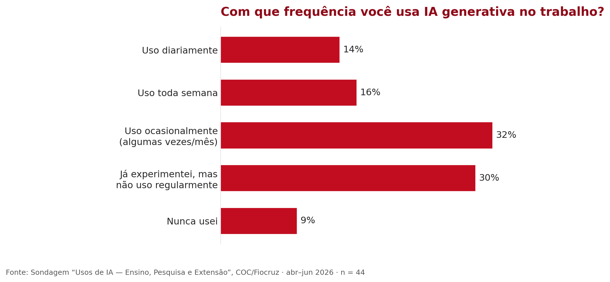
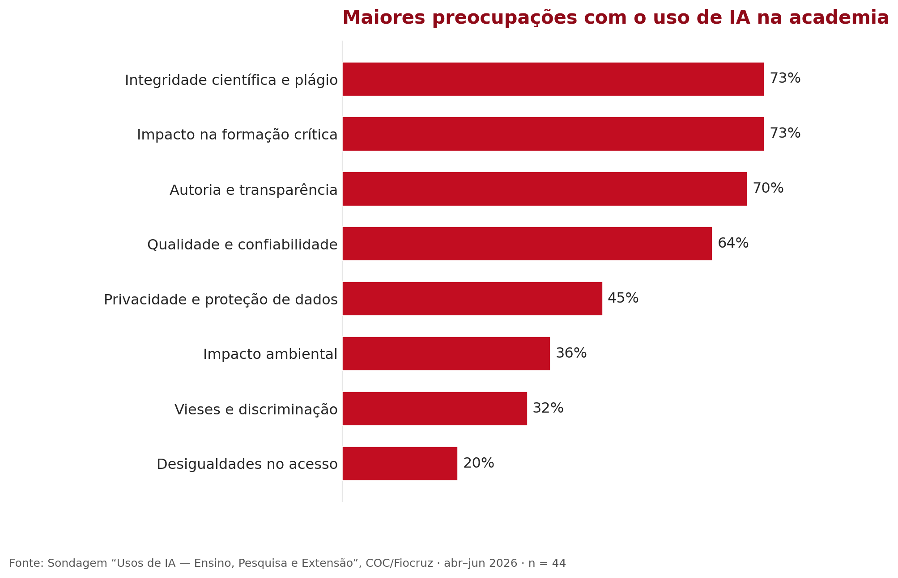
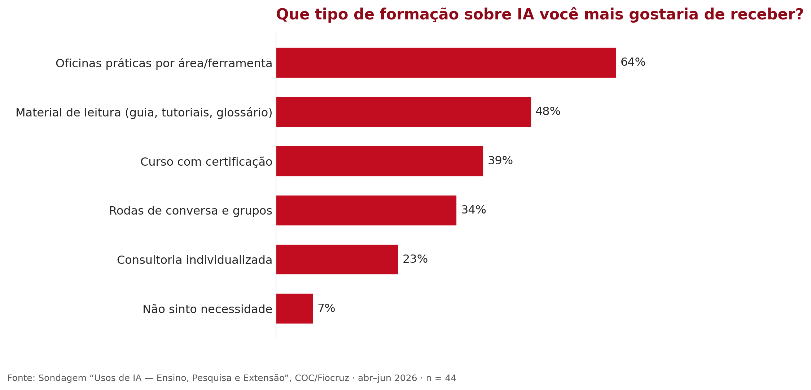

# 1. Apresentação

## 1.1 Histórico das Humanidades Digitais na COC

O debate sobre Humanidades Digitais na Casa de Oswaldo Cruz ganhou corpo durante a pandemia. Em 2021, o Departamento de Pesquisa em História das Ciências e da Saúde (Depes) e o Programa de Pós-Graduação em História das Ciências e da Saúde (PPGHCS), em parceria com o Centro de Humanidades Digitais da Unicamp e o Instituto Brasileiro de Informação em Ciência e Tecnologia (Ibict), ofertaram o curso “As humanidades no século XXI: teoria, prática e desafios de uma transformação no conhecimento”, coordenado por Dominichi Miranda de Sá (Depes-COC/Fiocruz), Kaori Kodama (PPGHCS-COC/Fiocruz), Thiago Nicodemo e Pedro Telles (Unicamp) e Ricardo Pimenta (Ibict). Com 50 vagas, o curso recebeu 80 inscrições, dando os primeiros indícios da demanda existente.

No ano seguinte, Daiane Rossi ministrou a disciplina Metodologias da Pesquisa em Humanidades Digitais no PPGHCS, em colaboração com Fábio Gouveia, do Programa de Pós-Graduação em Divulgação da Ciência, Tecnologia e Saúde (PPGDC) da COC, e do Programa de Pós-Graduação em Ciência da Informação do IBICT/UFRJ. A disciplina, ofertada remotamente, reuniu 55 pessoas entre matriculados e ouvintes, vindas não só dos programas envolvidos, mas de outros estados brasileiros, além de duas alunas oriundas de Moçambique. Ainda em 2022, os professores Marcos José de Araújo Pinheiro e Marcus Vinícius Pereira da Silva organizaram o curso “Preservação Digital: teorias e práticas”, que discutiu políticas de preservação de acervos digitais, gestão de risco e repositórios confiáveis, reunindo mais de 260 inscritos entre arquivistas, bibliotecários, museólogos e pós-graduandos. No mesmo ano, o corpo discente da Especialização em Divulgação e Popularização da Ciência organizou o seminário “Metaverso: novas tecnologias no campo da divulgação científica”, coordenado por Marcus Pinto Soares e Silva, com as palestras de Charles Douglas Martins (UFPE) e Nina da Hora (PUC-Rio), reunindo mais de 100 inscritos para discutir o conceito de metaverso e suas implicações para a divulgação científica e a museologia.

Em 2023, o curso de inverno “Novas metodologias em História das Ciências e da Saúde”, sob responsabilidade de Daiane Rossi, reuniu quase 200 participantes, discutindo, entre outras questões, a história digital em interface com a história das ciências. No mesmo ano, em agosto, a palestra “Impactos da Inteligência Artificial na historiografia”, com Rodrigo Bonaldo (UFSC) e mediação de Daiane Rossi, trouxe a [IA generativa](../conceitos/ia-generativa.md) para o centro dessa trajetória, que até então discutia Humanidades Digitais em sentido mais amplo.

Foi nesse terreno já preparado que, em 2025, Anita Lucchesi e Daiane Rossi ministraram a primeira edição do curso Letramento Acadêmico em Inteligência Artificial, voltado a estudantes e docentes de todos os programas da COC. Um dia inteiro de atividades revelou o tamanho da demanda represada: dúvidas conceituais sobre o que é e como funciona a IA generativa, insegurança sobre limites éticos, e uma vontade explícita de que a conversa continuasse depois do curso. Foi esse encerramento que tornou visível a necessidade de um trabalho contínuo.

Destacamos ainda que já estão em andamento na Casa de Oswaldo Cruz outras iniciativas de pesquisa que dialogam com os temas deste Guia. Nosso objetivo aqui, porém, foi apontar as iniciativas formativas na área que, de alguma maneira, serviram de base para a sua construção.

## 1.2 Construção coletiva do plano de trabalho

Dito isso, você, leitor, leitora, pessoa usuária deste guia, compreenderá melhor os seus objetivos se souber também um pouco do processo por trás da sua elaboração. Pois, embora escrito a quatro mãos pelas autoras que o assinam, este guia é resultado de um processo muito maior, que envolveu diversas pessoas da Casa de Oswaldo Cruz, participando voluntariamente de debates e trocas sobre esse desafio.

Em 2025, a convite da Vice-Direção de Pesquisa e Educação, oferecemos na Casa de Oswaldo Cruz um primeiro curso sobre letramento acadêmico e inteligência artificial. A procura e o debate que encerrou aquela primeira edição deixaram evidentes o interesse da comunidade e as lacunas a preencher, e levaram ao convite para uma segunda edição em 2026, agora integrada a um plano de ação mais amplo, que inclui este guia e um glossário de apoio ao uso de IA no ensino, na educação e na pesquisa.

Planejamos a produção do guia a partir das trocas com a comunidade. Duas convicções orientaram essa escolha: a de que sua construção não poderia ocorrer de forma isolada das necessidades de quem de fato atua na COC e a de que nossa própria perspectiva, como pesquisadoras e professoras que atuam sobre o tema, poderia estar enviesada pela nossa proximidade com o assunto. Por isso, sondamos a comunidade da COC por meio de um *survey*, que circulou entre abril e junho de 2026 e reuniu 44 respostas por adesão voluntária, sem pretensão de constituir uma amostra estatisticamente representativa. Em seguida, realizamos quatro grupos focais, nos dias 16, 17, 25 e 26 de junho, cujo *debriefing* foi apresentado em uma devolutiva à comunidade em 6 de julho de 2026.

O que ouvimos deu forma ao guia. Reafirmou-se o caráter transdisciplinar do trabalho e a percepção, não só na COC, mas na sociedade, de que a IA se apresenta como "um caminho sem volta" (na formulação de um dos participantes do grupo focal de 25 de junho). Entre os mais céticos e os mais curiosos, já há docentes e discentes que se lançam, ainda que timidamente, à experimentação: a maioria ainda usa a IA de forma ocasional ou apenas experimentou, e poucos a usam diariamente.

*Figura 1. Frequência de uso de IA generativa entre os respondentes da sondagem: a maioria usa ocasionalmente ou apenas experimentou; poucos usam diariamente.*

Com este material, queremos mitigar a falta de orientação no uso dessas ferramentas e, ao mesmo tempo, reduzir algumas das incertezas que cercam o universo da IA. Para isso, apresentamos termos e conceitos específicos da área em uma linguagem que esperamos tornar mais acessível, especialmente no glossário, a pessoas usuárias não especialistas. É possível começar a usar uma ferramenta de IA generativa sem saber, por exemplo, quais dados ela coleta, como os armazena ou se poderá reutilizá-los de maneira incompatível com a LGPD. Mesmo em tarefas aparentemente simples, como a tradução, atividade mais citada na sondagem, assinalada por 82% das pessoas respondentes, ou a síntese de textos, há cuidados a tomar.

Não por acaso, as maiores preocupações apontadas na sondagem são exatamente os eixos que este guia procura enfrentar: integridade científica e plágio (73%), impacto na formação crítica dos estudantes (73%) e autoria e transparência (70%).

*Figura 2. Maiores preocupações da comunidade com o uso de IA na academia: integridade científica, impacto na formação crítica e autoria e transparência no topo.*

Somam-se a essas preocupações os alertas recorrentes nos grupos focais sobre as alucinações e a fabricação de referências inexistentes, já comentadas na literatura recente sobre o tema (Lima, 2026, p. 9–10), a reprodução de vieses, preconceitos e formas de colonialidade nos sistemas de IA (Ferreira et al., 2025, p. 170-171; Seawright, 2025, p. 23-24) e seus impactos na docência e na avaliação. Entre estes últimos, destacam-se o receio de que o uso excessivo dessas ferramentas enfraqueça a autonomia cognitiva dos estudantes e o risco de uma pasteurização da escrita, produzindo um achatamento que ameaça a originalidade e a marca autoral quando a IA deixa de funcionar como apoio e passa a substituir o próprio trabalho de criação (Silva, 2024, p. 1312, 1320; Galasso, 2026, p. 174-175, 182).

Quando perguntada sobre o apoio que gostaria de receber, a comunidade pediu sobretudo oficinas práticas e material de leitura (guia, tutoriais e glossário), exatamente os instrumentos que este plano de ação reúne.

*Figura 3. Tipo de formação sobre IA que a comunidade mais gostaria de receber: oficinas práticas e material de leitura (guia, tutoriais e glossário) no topo.*

Desse processo nasceu também um instrumento concreto: um modelo de declaração de uso de IA, distribuído aos programas de pós-graduação da COC [→ ver Anexos: instruções e modelo de Declaração](anexos.md). O guia oferece apoio para enfrentar essas questões, sem a pretensão de exauri-las: categorias e ferramentas organizadas no glossário, alertas sobre riscos e caminhos para uma leitura crítica, de modo que ninguém precise partir do zero.

## 1.3 Objetivos do guia

Este guia de boas práticas no uso da inteligência artificial na Casa de Oswaldo Cruz é menos uma receita pronta do que uma orientação geral, talvez um mapa, com indicações de caminhos, e não o único jeito certo ou a fórmula correta de aproveitar essas ferramentas no nosso dia a dia de trabalho com a ciência, na pesquisa e na educação. Um uso pautado pelo respeito: ao próximo, aos dados privados, nossos e alheios, às normas e regras estabelecidas pelas nossas ciências e aos valores que orientam os nossos ofícios.

As palavras *mapa* e *caminhos* dão a medida do que ele pretende ser, considerando especialmente que esta é sua primeira versão: um traçado ainda em esboço, mas um começo daquilo que entendemos como um plano em direção a um “letramento crítico e da vigilância institucional para enfrentar a obscuridade algorítmica” (COELHO, 2026, p. 09).

Dizemos isso porque o próprio guia nasce como desdobramento de um primeiro curso de formação sobre o tema, organizado pela COC em novembro de 2025. A segunda edição do curso, diante das constantes novidades e dos desafios éticos e epistemológicos que a inteligência artificial não para de colocar, exige que continuemos nos atualizando.

É importante compreender que, pela própria natureza dos temas de que trata, pela inevitável obsolescência tecnológica e pela rapidez com que a inteligência artificial se expande e produz desdobramentos na vida em sociedade e, por consequência, na pesquisa, este guia já nasce datado, já nasce incompleto. Ele se coloca, assim, ao lado de trabalhos publicados recentemente que decidem enfrentar essa nova frente de questões e problemas, mesmo sabendo que “*se trata de un área de conocimiento en desarrollo y permanente transformación*” (PIRO MITTELMAN, 2025, p. 162). Não seria possível desenhar o mapa do tamanho do território como já nos alertara Jorge Luis Borges.

Ainda assim, consideramos importante compartilhá-lo com vocês desde já, admitindo que haverá imperfeições, seções em que o guia não dará conta de todos os assuntos e um glossário de termos e ferramentas que por vezes se mostrará limitado. Construímos o glossário, justamente, com a intenção de que seja de contínua atualização no ambiente digital. Por isso, na seção **[Contribuir](../contribuir.md)**, a pessoa usuária poderá propor que o glossário do guia inclua um novo verbete, sobre uma ferramenta ou um conceito ainda não contemplados.

> Na prática, os objetivos deste guia são:

- promover o **letramento digital e acadêmico em IA** necessário para compreender criticamente as ferramentas antes de usá-las, em articulação com o Glossário como material de apoio;

- orientar a **integridade acadêmica**: autoria e responsabilidade humana, combate ao plágio e centralidade da decisão humana;

- estabelecer parâmetros de **transparência**, sobretudo quanto à declaração de uso e não uso de IA em trabalhos acadêmicos (Portaria CNPq nº 2.664, de 6 de março de 2026; modelo adotado pela COC);

- orientar sobre **usos recomendados e usos vedados** nas diferentes etapas da pesquisa, do ensino e da divulgação científica;

- apoiar as **especificidades das áreas de atuação** na COC**,** História das Ciências e da Saúde, Divulgação Científica e Patrimônio da Saúde;

- manter-se um **documento vivo**, aberto a sugestões e à atualização contínua.
